# Roadmap & KPI Planner

A real-time collaborative roadmap editor where teams can plan goals, track KPIs, and stay in sync — all through direct browser-to-browser connections using **WebRTC**.


## What It Does

- **Hierarchical roadmap planning** — create goals, nest KPIs underneath, and track progress with sliders
- **Real-time collaboration** — changes sync instantly between all connected peers
- **Peer-to-peer architecture** — data flows directly between browsers via WebRTC data channels, not through a server
- **Conflict-free editing** — powered by [Yjs](https://yjs.dev/) CRDTs, concurrent edits merge automatically without conflicts
- **Offline-capable** — your roadmap persists in localStorage and syncs when you reconnect

## How It Works

### WebRTC Peer Connections

The app uses **WebRTC RTCPeerConnection** data channels to send binary Yjs CRDT updates directly between browsers. No data passes through the server after the initial connection handshake.

```mermaid
graph TD
    Host["🖥️ Host (Alice)"]

    J1["💻 Joiner 1 (Bob)"]
    J2["💻 Joiner 2 (Carol)"]
    J3["💻 Joiner 3 (Dave)"]

    J1 <-->|"WebRTC Data Channel\n(binary Yjs updates)"| Host
    J2 <-->|"WebRTC Data Channel\n(binary Yjs updates)"| Host
    J3 <-->|"WebRTC Data Channel\n(binary Yjs updates)"| Host

    Server["☁️ Signaling Server"]

    Server -.->|"offer/answer exchange\n(setup only)"| Host
    Server -.->|"offer/answer exchange\n(setup only)"| J1
    Server -.->|"offer/answer exchange\n(setup only)"| J2
    Server -.->|"offer/answer exchange\n(setup only)"| J3

    style Host fill:#d1fae5,stroke:#059669,stroke-width:2px
    style J1 fill:#dbeafe,stroke:#2563eb,stroke-width:2px
    style J2 fill:#dbeafe,stroke:#2563eb,stroke-width:2px
    style J3 fill:#dbeafe,stroke:#2563eb,stroke-width:2px
    style Server fill:#fef3c7,stroke:#d97706,stroke-width:2px,stroke-dasharray: 5 5
```



The host acts as a hub in a **star topology** — each joiner connects directly to the host, and the host relays updates between all peers. The signaling server is only used during the initial WebRTC handshake (dashed lines) and is not involved once data channels are open (solid lines).

### Server-Assisted Signaling

The only role of the server is **signaling** — helping peers find each other and exchange the WebRTC offers/answers needed to establish a direct connection. Once connected, the server is no longer involved:

1. Host creates a session and polls for join requests
2. Joiner submits a WebRTC offer to the session
3. Host receives the offer, creates an answer, and posts it back
4. Joiner retrieves the answer, completing the WebRTC handshake
5. A direct data channel opens — all further communication is peer-to-peer

### CRDT-Based Sync

The shared document is a [Yjs](https://yjs.dev/) `Y.Doc` containing nested `Y.Map` and `Y.Array` structures. When any peer makes a change:

1. Yjs produces a binary update (a compact diff)
2. The update is sent over the WebRTC data channel to connected peers
3. Each peer applies the update to their local Y.Doc
4. React re-renders the affected tree nodes

Because Yjs uses CRDTs (Conflict-free Replicated Data Types), simultaneous edits by multiple users always converge to the same state — no conflict resolution logic needed.

## Screenshots

### Starting State
Create goals and KPIs locally before connecting to a session.


### Host View
Host a named session and see connected peers with color-coded status chips.


### Joiner View
Join a session by name. The full roadmap syncs over instantly via WebRTC.


### Peer Status Indicators

The connection panel shows real-time peer status with color-coded chips:
- **Green** — connected and syncing
- **Amber** (pulsing) — connection in progress
- **Gray** — disconnected (auto-cleaned after 30s)

## Tech Stack

- **[Bun](https://bun.sh)** — server runtime with HTML imports, no bundler config needed
- **React** — UI with context-based state management
- **[Yjs](https://yjs.dev/)** — CRDT library for conflict-free collaborative editing
- **WebRTC** — browser-native peer-to-peer data channels
- **Tailwind CSS** — utility-first styling

## Getting Started

Install dependencies:

```bash
bun install
```

Start the development server:

```bash
bun dev
```

Open `http://localhost:3000` in two browser tabs. In one tab, host a session. In the other, join it by name. Start editing — changes sync in real time.

## Project Structure

```
src/
├── index.ts           # Bun server with API routes + HTML import
├── signaling.ts       # In-memory session store for WebRTC signaling
├── webrtc.ts          # WebRTC primitives (createOffer, acceptOffer, acceptAnswer)
├── store.tsx          # React context: Y.Doc + multi-peer management + relay
├── ConnectionPanel.tsx # Session UI with peer status chips
├── TreeNode.tsx       # Recursive tree node component
└── App.tsx            # Main application shell
```

## TODOs

- [ ] Many-to-many relationships - there can be initiatives that drive many KPIs, And KPIs can be driven by many initiatives
- [ ] Sankey chart to visualise the relationship of expected gains
